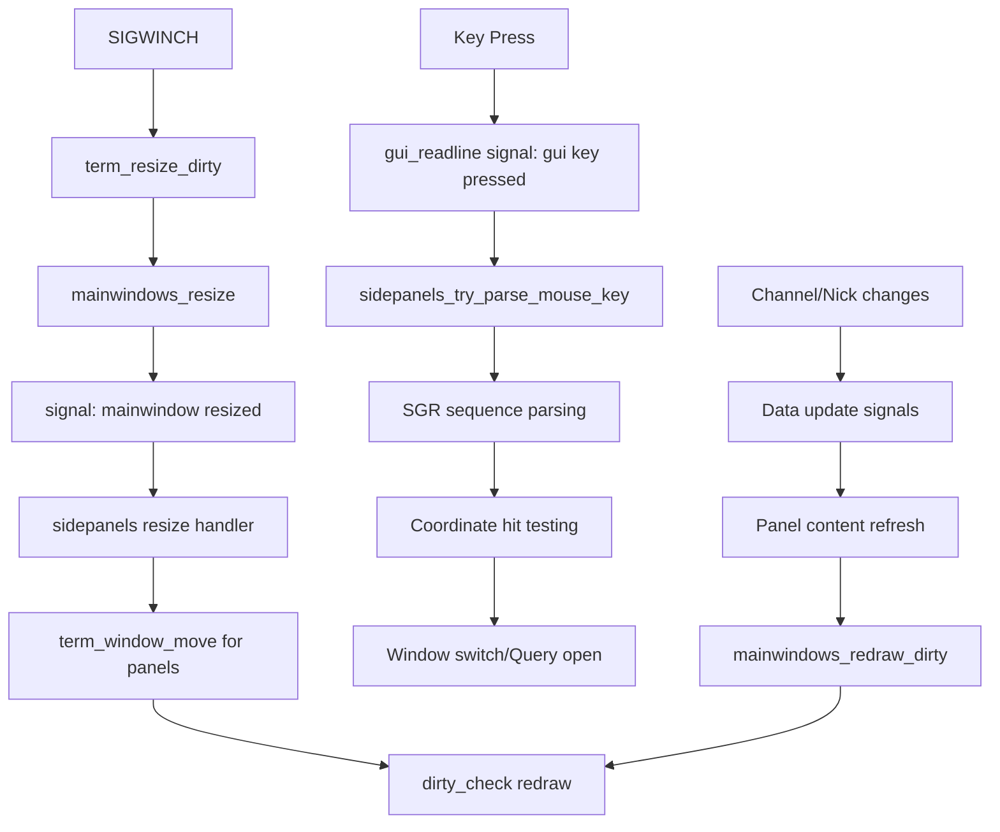

# Design Document

## Overview

The native panels feature implements a WeeChat-like three-column layout in Irssi by extending the existing window management system. The design leverages the working implementation from the `origin/feature/sidepanels-native` branch, which already provides functional resize handling. Mouse interaction and data rendering need to be completed. The implementation integrates natively with Irssi's mainwindow system using statusbar column reservations and TERM_WINDOW objects for panel rendering.

## Architecture

### Core Components

#### 1. Panel Management System (`sidepanels.c/h`)
- **SP_MAINWIN_CTX**: Context structure per main window containing:
  - TERM_WINDOW objects for left and right panels
  - Selection and scroll state tracking
  - Cached geometry for hit-testing and drawing
- **Settings Integration**: Dynamic configuration through Irssi's settings system
- **Memory Management**: Hash table mapping main windows to panel contexts

#### 2. Window System Integration
- **Column Reservations**: Uses existing `statusbar_columns_left/right` fields in `MAIN_WINDOW_REC` 
- **Public API**: Implements `mainwindow_set_statusbar_columns(MAIN_WINDOW_REC *mw, int left, int right)` function
- **Per-MainWindow Context**: Each MAIN_WINDOW_REC gets its own panel context for split window support
- **TERM_WINDOW Management**: Creates/moves/destroys `left_panel_win` and `right_panel_win` with size_dirty marking
- **Signal-Based Updates**: Uses signal handlers instead of dirty_check() integration for cleaner separation

#### 3. Mouse Interaction System (Primary Interface)
- **Terminal Mouse Support**: Adds SGR 1006 mouse tracking to `term-terminfo.c`
- **New Signal System**: Implements `"gui mouse event"` signal with (x,y,button,type) data
- **SGR Mouse Parsing**: Handles `\033[<button;x;y;M/m` sequences in terminal input
- **Hit Testing**: Maps mouse coordinates to panel elements using cached TERM_WINDOW geometry
- **Action Dispatch**: Converts clicks to window switches or query opens via existing signal system
- **Scroll Support**: Handles mouse wheel events for scrolling through long lists

### Data Flow



## Components and Interfaces

### 1. Panel Context Management

```c
// Extended MAIN_WINDOW_REC with panel windows
typedef struct {
    // ... existing MAIN_WINDOW_REC fields ...
    TERM_WINDOW *left_panel_win;   // Left panel terminal window  
    TERM_WINDOW *right_panel_win;  // Right panel terminal window
} MAIN_WINDOW_REC;

// Panel context per main window
typedef struct {
    // Selection and scroll state
    int left_selected_index;
    int left_scroll_offset;
    int right_selected_index;
    int right_scroll_offset;
    
    // Cached content for dirty checking
    char **left_content_cache;
    char **right_content_cache;
    int left_content_lines;
    int right_content_lines;
} SP_MAINWIN_CTX;
```

### 2. Settings Interface

```c
// Configuration settings
static int sp_left_width;          // Left panel width
static int sp_right_width;         // Right panel width  
static int sp_enable_left;         // Enable left panel
static int sp_enable_right;        // Enable right panel
static int sp_auto_hide_right;     // Auto-hide right panel when not on channel
```

### 3. Core API Functions

```c
void sidepanels_init(void);
void sidepanels_deinit(void);
gboolean sidepanels_try_parse_mouse_key(unichar key);
```

### 4. Integration Points

#### Mainwindow System Integration
- **Column Reservation**: `mainwindow_set_statusbar_columns(mw, left_cols, right_cols)`
- **Resize Signals**: Connect to `"mainwindow resized"` and `"mainwindow created"`
- **Terminal Windows**: Create TERM_WINDOW objects within reserved columns

#### Mouse System Integration  
- **Key Processing**: Hook into `"gui key pressed"` signal via `gui_readline_init()` integration
- **SGR Parsing**: Handle `\033[<button;x;y;M/m` sequences in `sidepanels_try_parse_mouse_key()`
- **Coordinate Mapping**: Convert terminal coordinates to panel-relative positions using cached geometry
- **Integration Point**: Connect through `gui-readline.c` signal emission system

#### Data Source Integration
- **Channel Lists**: Query active channels from server objects
- **Nicklists**: Access channel nicklists through existing APIs
- **Activity Tracking**: Monitor `data_level` from WI_ITEM_REC for activity indicators

## Data Models

### 1. Panel Content Models

#### Channel List Item
```c
typedef struct {
    char *name;              // Channel name (#channel)
    SERVER_REC *server;      // Associated server
    CHANNEL_REC *channel;    // Channel record
    int activity_level;      // Activity indicator level
    gboolean is_active;      // Currently active channel
} ChannelListItem;
```

#### Nicklist Item  
```c
typedef struct {
    char *nick;              // Nickname
    char *prefix;            // Mode prefix (@, +, etc.)
    int level;               // User level/mode
    gboolean is_away;        // Away status
} NicklistItem;
```

### 2. Panel State Model

```c
typedef struct {
    GList *items;            // List of displayable items
    int selected_index;      // Currently selected item
    int scroll_offset;       // Scroll position
    int visible_count;       // Number of visible items
    gboolean needs_refresh;  // Redraw flag
} PanelState;
```

## Error Handling

### 1. Terminal Window Creation Failures
- **Fallback Strategy**: Gracefully disable panels if TERM_WINDOW creation fails
- **Error Logging**: Log terminal window allocation failures
- **State Cleanup**: Ensure proper cleanup of partial initialization

### 2. Mouse Parsing Errors
- **Sequence Validation**: Validate SGR mouse sequences before processing
- **Boundary Checking**: Ensure coordinates are within valid panel bounds
- **Fallback Behavior**: Pass unrecognized sequences to default handlers

### 3. Resize Edge Cases
- **Minimum Widths**: Left panel minimum 8 chars, right panel minimum 6 chars
- **Auto-Hide Logic**: Hide nicklist first (< 80 cols), then shrink left panel (< 60 cols), hide both (< 40 cols)
- **Multi-MainWindow Support**: Panel context per MAIN_WINDOW_REC for proper split window support
- **State Preservation**: Maintain selection/scroll state across resizes and window switches

### 4. Data Consistency
- **Null Checks**: Validate server/channel pointers before access
- **Stale References**: Handle disconnected servers and closed channels
- **Memory Management**: Prevent leaks in dynamic content lists

## Testing Strategy

### 1. Unit Testing
- **Panel Context Management**: Test creation, destruction, and state management
- **Mouse Coordinate Mapping**: Verify hit-testing accuracy
- **Settings Integration**: Test configuration changes and persistence

### 2. Integration Testing  
- **Resize Behavior**: Test panel layout under various terminal sizes
- **Mouse Interaction**: Verify click-to-switch and click-to-query functionality
- **Data Updates**: Test real-time updates from channel/nick changes

### 3. Edge Case Testing
- **Extreme Sizes**: Test behavior with very narrow/wide terminals
- **Network Events**: Test behavior during connects/disconnects
- **Memory Pressure**: Test behavior under low memory conditions

### 4. Compatibility Testing
- **Terminal Types**: Test across different terminal emulators
- **Theme Compatibility**: Verify appearance with various themes
- **Existing Features**: Ensure no regression in core Irssi functionality

## Implementation Phases

### Phase 1: Foundation (Leverage Existing Code)
- Extract and refine working code from `origin/feature/sidepanels-native`
- Ensure proper C89 compatibility and build system integration
- Implement robust error handling and fallback mechanisms

### Phase 2: Enhanced Data Integration
- Implement comprehensive channel list population
- Add full nicklist support with proper mode indicators
- Integrate activity tracking and highlighting

### Phase 3: Advanced Features
- Add theme integration for consistent appearance
- Implement configuration persistence
- Add keyboard navigation support

### Phase 4: Polish and Optimization
- Performance optimization for large channel/nick lists
- Enhanced mouse interaction (drag, double-click)
- Accessibility improvements and documentation